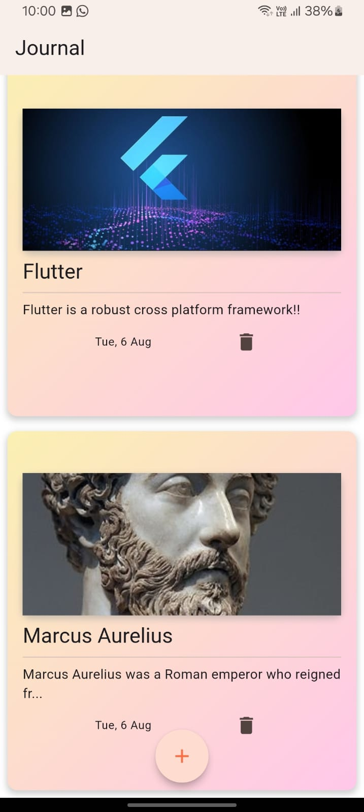
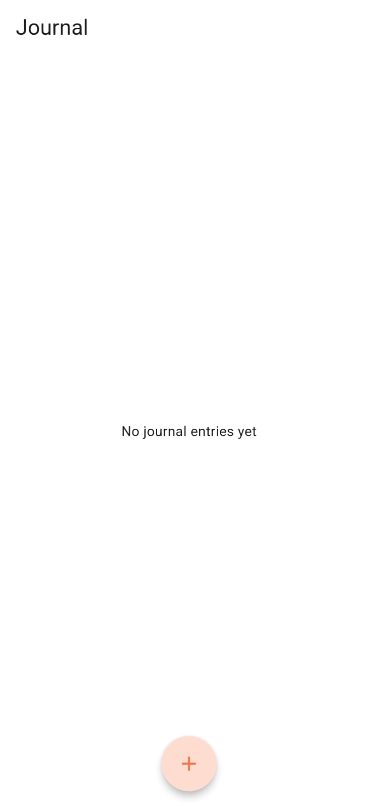
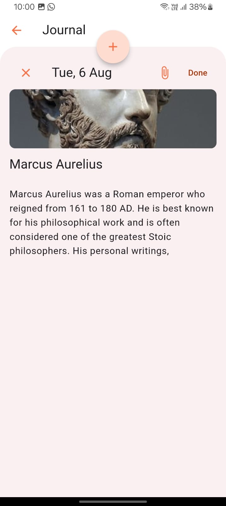

# Journal Local App

## Overview

The Journal Local App is a Flutter application designed for storing and managing journal entries locally on a device. The app leverages the `sqflite` package for local database management, follows clean architecture principles, and uses BLoC for state management. This README provides an overview of the app's architecture, dependencies, and setup instructions.

## Working Demo

https://polarized-isthmus-96b.notion.site/Journal-Local-Storage-App-8662afa10ce8486e9b54f07ed6d28189?pvs=4

## Features

- Local storage of journal entries using SQLite.
- Clean architecture for maintainable and scalable code.
- State management using BLoC.
- Image picking functionality for journal entries.

## Architecture

The app follows the **clean architecture** design pattern, which separates the application into distinct layers:

1. **Presentation Layer**: Contains Flutter widgets and manages the UI.
2. **Domain Layer**: Contains business logic and entities.
3. **Data Layer**: Manages data sources, repositories, and data models.

**State Management**: BLoC (Business Logic Component) is used for managing state in a reactive manner, making the app scalable and testable.

### Home Screen

### No Journal

### Add Journal Entry

## Dependencies

The app uses the following dependencies:

- `intl: ^0.19.0` - Provides internationalization and localization support.
- `image_picker: ^1.1.2` - Allows users to pick images from the device gallery or camera.
- `sqflite: ^2.3.3+1` - SQLite plugin for Flutter, used for local database storage.
- `path: ^1.9.0` - Provides utilities for working with file paths.
- `fpdart: ^1.1.0` - Functional programming tools for Dart.
- `flutter_bloc: ^8.1.6` - Flutter BLoC library for state management.
- `get_it: ^7.7.0` - Service locator for dependency injection.
